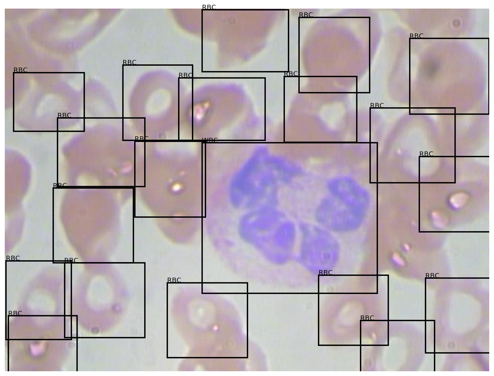

# Cell Vision
Cell Vision for training models. This application's purpose is to analyze images selected of blood cell images from a microscopic view point, and identify and display statistics of the images.

# Displayed is an example of what is intended to be shown through the application with more statistics. 
